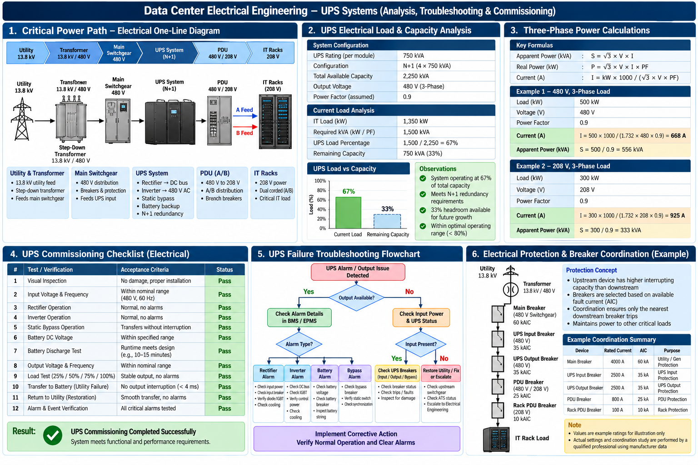

# UPS Electrical Engineering Overview

This project demonstrates key electrical engineering concepts used in mission-critical data center power systems.

## Technical Areas

- Critical power distribution from utility through switchgear, UPS, PDU, and IT loads
- UPS N+1 redundancy and capacity analysis
- Three-phase power calculations including kW, kVA, current, voltage, and power factor
- UPS electrical commissioning and functional testing
- UPS alarm and failure troubleshooting methodology
- Electrical protection and breaker coordination concepts
- BMS/EPMS-assisted electrical monitoring and fault analysis

## Engineering Approach

The example demonstrates how electrical system information can be used to evaluate equipment loading, available capacity, system redundancy, abnormal operating conditions, and UPS performance during commissioning and troubleshooting.

> **Portfolio Notice:** All system configurations, equipment ratings, calculations, values, and scenarios shown here are fictional examples created solely for technical demonstration. No employer-confidential, customer, or site-specific information is included.
